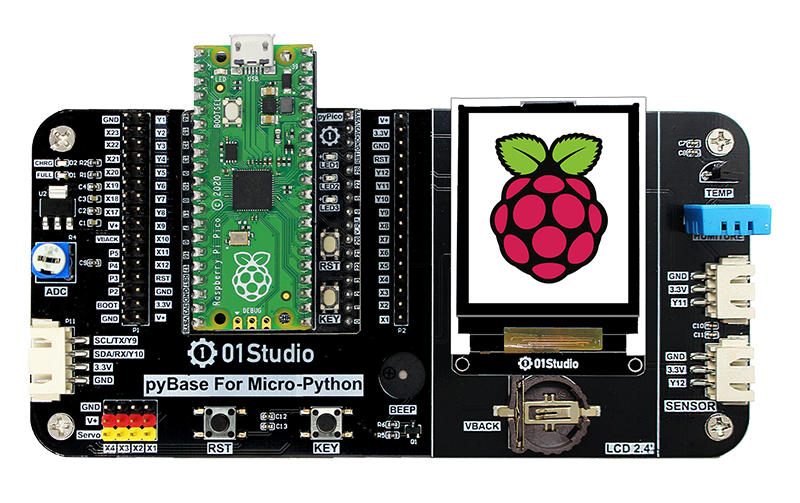
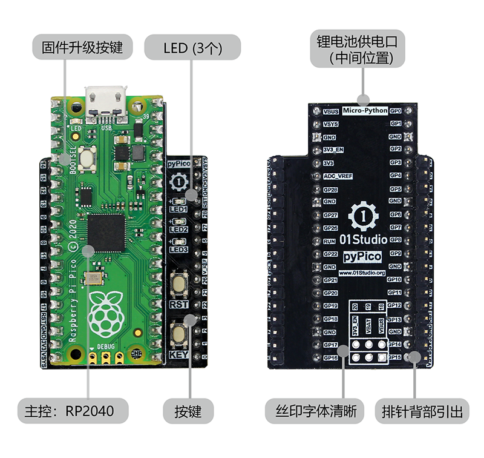

pyPico (RaspberryPi RP2040)
============================

Resource Downlaod
------------------
* `Click me to download <https://01studio-1258570164.cos.ap-guangzhou.myqcloud.com/Resource_Download_EN/MicroPython/09-pyPico/%E9%9B%B6%E4%B8%80%E7%A7%91%E6%8A%80%EF%BC%8801Studio%EF%BC%89MicroPython%E5%BC%80%E5%8F%91%E5%A5%97%E4%BB%B6%EF%BC%88%E5%9F%BA%E4%BA%8E%E6%A0%91%E8%8E%93%E6%B4%BEPico%E5%B9%B3%E5%8F%B0%EF%BC%89%E9%85%8D%E5%A5%97%E8%B5%84%E6%96%99_2021-3-21.rar>`_ (Chinese)

Product Picture
----------------

  pyPico Development Kits
  

   
  pyPico

Purchase
--------------
- 01Studio AliExpress store：https://www.aliexpress.com/store/5598484

Technical Support
------------------
- support@01studio.org

About 01Studio
--------------

  | :ref:`Introduction <about>`  
  | :ref:`Contact us <about>`
